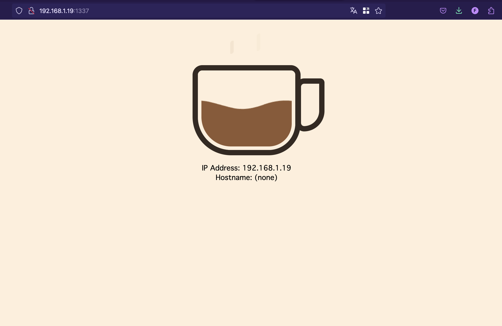

# Talos Coffee Extension

This project is a demo to create a Talos extension. It showcases how to extend Talos with custom functionality using a simple coffee-related example.

## Getting Started

There are two ways to get started with this project:

- Using the ISO that already has the extension installed
- Installing the extension using the installer image

### Using the ISO

1. Download the ISO available on latest Builds.
2. Boot the ISO on a machine.

Open your browser and navigate to `http://NODE_IP:1337/` to access the app UI.

### Using the Installer Image

1. Boot your machine with any Talos iso.
2. In your machine configuration, change `machine.install.image` to an [image in Package Registry of this repository](https://github.com/qjoly/talos.coffee.extension/pkgs/container/talos.coffee.extension%2Finstaller).

## Features

- Nothing, It only shows a coffee cup and few information about the node (Hostname / IP).

Like we say in France: "Inutile, donc indispensable" (Useless, therefore essential).

